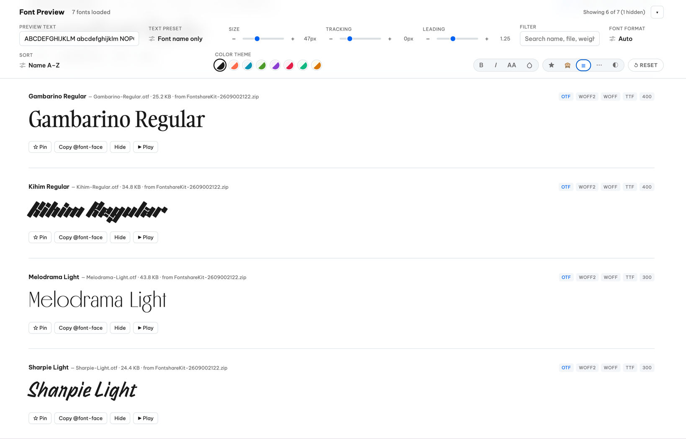

# Fonter

Automatically finds and extracts font files (.ttf, .otf, .woff, .woff2) from your folders or .zip archives, and generating a fast, single-page HTML preview of your entire collection at once.


## Features
* **Deep Zip Scanning:** Automatically digs through zip archives to extract font files.
* **Loose Font Support:** Can scan for already-unzipped font files sitting directly on current folder.
* **Sub-folder Scanning**: Scans through all sub-folders by default to find nested font files.
* **Smart Organization:** Merges duplicate formats (e.g., `Roboto-Bold.otf` and `Roboto-Bold.ttf`) into a single preview card with a `formats` list.
* **Intelligent Weight/Style Detection:** Parses filenames to automatically guess font weights and italic styles.
* **Self-Contained Output:** Generates a portable `index.html` file alongside a `fonts/` folder and `manifest.json`.
* **Live Development Server:** Built-in live-reloading dev server for quickly editing the HTML template without re-extracting archives.




## Global Installation (Mac/Linux)

To run `fonter` from anywhere on your system as a global command, create a symbolic link in your `~/bin` directory (make sure `~/bin` is included in your system's `$PATH`).

1. **Clone this repository** to a permanent location (e.g., `~/Projects/fonter`):
   ```bash
   git clone [https://github.com/ricafolio/fonter.git](https://github.com/ricafolio/fonter.git)
   cd fonter
   ```
2. **Make the script executable:**
   ```bash
   chmod +x fonter.py dev_server.py
   ```
3. **Create a symbolic link** in your bin folder:
   ```bash
   ln -s "$(pwd)/fonter.py" ~/bin/fonter
   ```
> **Important:** Do not use `cp` to copy the script. Using `ln -s` ensures the script can dynamically resolve its path and locate its companion `template.html` file!

## Usage

Navigate to any directory containing `.zip` files (or folders of zip files) with fonts, and execute the command. This will create a `fonter-preview/` directory containing your extracted fonts and an `index.html` preview file, and automatically prompt you to open it.

### Command-Line Options

| Flag | Description | Default |
| :--- | :--- | :--- |
| `--output <path>` | Custom output folder name or absolute path. | `fonter-preview` |
| `--no-recurse-dirs` | Only look for `.zip` files directly in the current folder, ignoring subfolders. | `false` |

## Add fonter to macOS Quick Action (Right-Click Menu)

You can add `fonter` to your Mac's right-click menu so you can generate a preview without opening the terminal.

1. Open the **Automator** app on your Mac and create a new **Quick Action**.
2. At the top of the workflow window, set:
   * Workflow receives current: **files or folders**
   * in: **Finder**
3. In the left sidebar, search for **Run Shell Script** and drag it into the main workflow area.
4. In the Run Shell Script settings, change **Pass input:** to **as arguments**.
5. Paste the following code into the script box, completely replacing the default code:

   ```bash
   # Fix Automator's limited $PATH so it can find Python and your global fonter command
   export PATH="/opt/homebrew/bin:/usr/local/bin:$HOME/bin:$PATH"

   TARGET="$1"

   # If a folder was right-clicked, go inside it. If a file was right-clicked, go to its parent folder.
   if [ -d "$TARGET" ]; then
       cd "$TARGET"
   else
       cd "$(dirname "$TARGET")"
   fi

   # Run the extractor
   fonter

   # Automatically open the generated preview in your default browser
   if [ -f "fonter-preview/index.html" ]; then
       open "fonter-preview/index.html"
   fi
   ```
6. Press `Cmd + S` to save and name it **Run Fonter**.

## Development

If you want to edit the design or structure of the preview page (`template.html`), you can use the built-in development server with live-reloading.

1. **Clone the project** to your machine and navigate to it:
   ```bash
   git clone [https://github.com/ricafolio/fonter.git](https://github.com/ricafolio/fonter.git)
   cd fonter
   ```
2. **Generate a baseline build:** Put a zip file containing fonts into the project root and run the extractor once to generate the initial output folder:
   ```bash
   python3 fonter.py
   ```
3. **Start the development server:** 
   ```bash
   python3 dev_server.py
   ```
   This will automatically open a browser tab. Any edits you make to `template.html` and save will instantly trigger a live reload in your browser without needing to run the slow font-extraction process again!

### Dev Server Options

| Flag | Description | Default |
| :--- | :--- | :--- |
| `--output <name>` | Point to a specific output folder to reuse. | `fonter-preview` |
| `--port <number>` | Run the dev server on a custom port. | `8000` |
| `--demo` | Use fabricated placeholder fonts to preview the UI/CSS without needing real fonts extracted. | `false` |
| `--no-browser` | Disable automatically opening a browser tab. | `false` |
