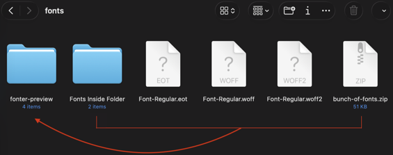
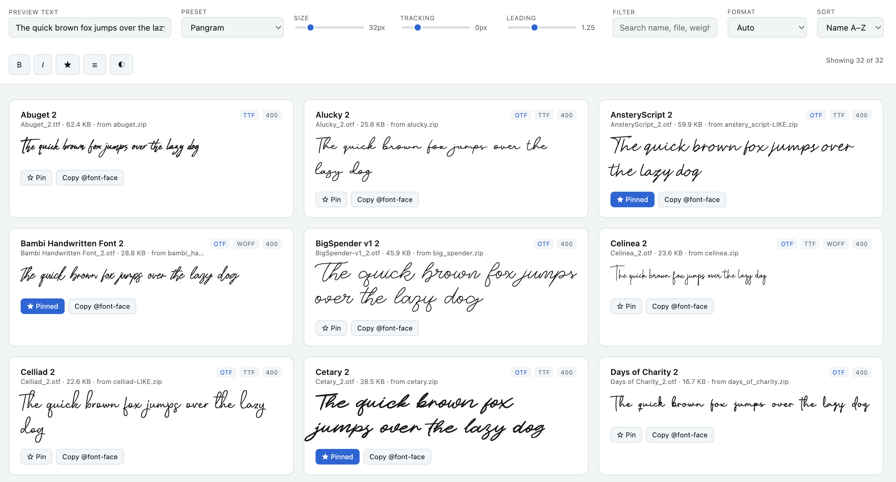

# fonter

A small script for your folder full of zipped fonts — it extracts every one of them and builds a single HTML page so you can preview them all at once.



> run it in your folder



> preview in webpage

## What it does

- Scans the current folder (and subfolders) for `.zip` files and loose font files
- Opens every zip and pulls out any `.ttf`, `.otf`, `.woff`, `.woff2`
  file
- Handles duplicate filenames across zips without overwriting anything
- Skips corrupt zips and junk files instead of crashing
- Outputs a `fonter-preview/` folder with an `index.html` you just open
  in a browser — sliders for size/spacing/line-height, search, sort,
  pin favorites, copy CSS, dark mode, grid/list view

---

## Examples

```bash
# scans current folder for zips & loose fonts, writes to fonter-preview/

#  basic run with python, script must be in same folder of working folder
python3 fonter.py

#  basic run via global install (macOS/Windows, see below), run script from any folder
fonter

# custom output folder name
fonter --output client-fonts

# also scan subfolders for loose font files
fonter --scan-folders

# only scan zips in current folder, skip zips in subfolders
fonter --no-recurse-dirs

# combine flags
fonter --output client-fonts --no-recurse-dirs

# send the output somewhere else entirely (still scans zips in the current folder)
fonter --output /Users/me/Desktop/fonts-preview-1
```

---

## Option 1 — Run it with Python, per folder

1. Put `fonter.py` in (or `cd` your terminal into) the folder with your zips.
2. Run:

   ```bash
   python3 fonter.py
   ```

   (Windows: `python fonter.py`)

3. Open `fonter-preview/index.html`.

**Flags:**

```bash
python3 fonter.py --output my-preview   # custom output folder name
python3 fonter.py --no-recurse-dirs     # only look for zips directly in this folder, not subfolders
```

---

## Option 2 — Install globally on macOS

1. ```bash
   mkdir -p ~/bin
   cp ~/Downloads/fonter.py ~/bin/fonter
   chmod +x ~/bin/fonter
   ```

2. Add `~/bin` to PATH (skip if already there):

   ```bash
   echo 'export PATH="$HOME/bin:$PATH"' >> ~/.zshrc
   source ~/.zshrc
   ```

3. From any folder with zips:

   ```bash
   fonter
   ```

If you'll keep editing the script, symlink instead of copying so changes
apply immediately:

```bash
ln -sf ~/dev/font-tools/fonter.py ~/bin/fonter
chmod +x ~/dev/font-tools/fonter.py
```

**Troubleshooting:**
- `permission denied: fonter` → run `chmod +x ~/bin/fonter` (if it's a
  symlink, `chmod` the real file it points to).
- `can't find '__main__' module` → `~/bin/fonter` is a directory, not a
  file. Check with `ls -la ~/bin/fonter`, `rm -rf` it, redo step 1.
- After fixing either, run `hash -r` before retrying.

---

## Option 3 — Install globally on Windows

1. Confirm Python is on PATH: `python --version`
2. Create a scripts folder, e.g. `C:\Users\<you>\bin`
3. Copy `fonter.py` into it, keeping the `.py` extension
4. Add that folder to PATH: Win → search "Environment Variables" →
   Edit the system environment variables → Environment Variables →
   under User variables, edit `Path` → add `C:\Users\<you>\bin` →
   restart your terminal
5. In the same folder, create `fonter.cmd` containing:

   ```bat
   @python "%~dp0fonter.py" %*
   ```

6. From any folder with zips:

   ```powershell
   fonter
   ```

---

## Notes

- If two zips both contain a file with the same name, both are kept —
  the second gets auto-renamed. Each preview card shows its source zip.
- `fonter-preview/manifest.json` has the raw metadata for every extracted
  font if you want to use it elsewhere.
